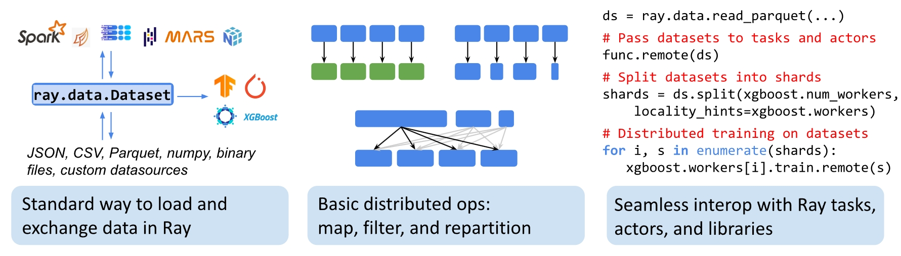
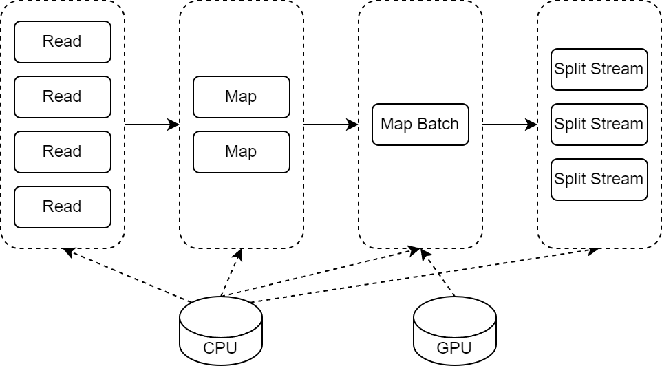

# Blazing Fast IO Tutorial

## TL;DR
Hugging Face Dataset and Ray Data is all you need.



Load a dataset from [Hugging Face Hub](https://huggingface.co/datasets) or your own [loading script](https://huggingface.co/docs/datasets/create_dataset#from-local-files)
```python
# From Hugging Face Hub
dataset = load_dataset("lj_speech", split='train')

# From loading script
dataset = load_dataset("path/to/your/script.py", split='train')
```

Convert the data to [Parquet](https://parquet.apache.org/) files. Actually, Hugging Face Dataset already does this for 
you if you use the following loading code:
```python
ds = load_dataset("lj_speech", revision="refs/convert/parquet", data_dir="main")
```

For those who want to do it themselves, here is the code:

**Remember: Audio and Image files may not be embedded in the Parquet files if you directly call `dataset.to_parquet()`**
```python
import os
from datasets import load_dataset
from datasets.features.features import require_decoding
from datasets.download.streaming_download_manager import xgetsize
from datasets import config
from datasets.utils.py_utils import convert_file_size_to_int
from datasets.table import embed_table_storage
from tqdm import tqdm

data_dir = 'output_parquets'
max_shard_size = '500MB'

decodable_columns = (
    [k for k, v in dataset.features.items() if require_decoding(v, ignore_decode_attribute=True)]
)
dataset_nbytes = dataset._estimate_nbytes()
max_shard_size = convert_file_size_to_int(max_shard_size or config.MAX_SHARD_SIZE)
num_shards = int(dataset_nbytes / max_shard_size) + 1
num_shards = max(num_shards, 1)
shards = (dataset.shard(num_shards=num_shards, index=i, contiguous=True) for i in range(num_shards))

# Embed Audio and Image as bytes in the Parquet files
def shards_with_embedded_external_files(shards):
    for shard in shards:
        format = shard.format
        shard = shard.with_format("arrow")
        shard = shard.map(
            embed_table_storage,
            batched=True,
            batch_size=1000,
            keep_in_memory=True,
        )
        shard = shard.with_format(**format)
        yield shard
shards = shards_with_embedded_external_files(shards)

os.makedirs(data_dir)

for index, shard in tqdm(
    enumerate(shards),
    desc="Save the dataset shards",
    total=num_shards,
):
    shard_path = f"{data_dir}/{index:05d}-of-{num_shards:05d}.parquet"
    shard.to_parquet(shard_path)
```

Now we could load the Parquet files with [Ray Data](https://docs.ray.io/en/latest/data/data.html) to leverage it's
distributed computing capabilities. Remember to use your dataset's [Feature](https://huggingface.co/docs/datasets/about_dataset_features)
to correct decode the data.
```python
# Read Parquet files (with parallelism A)
ds = ray.data.read_parquet('lj_speech_parquets')#, parallelism=A)
# Map decoding (with B cpus and autoscaling concurrency from C to D)
features = datasets.get_dataset_config_info("lj_speech").features
ds = ds.map(features.decode_example)#, num_cpus=B, concurrency=(C, D))
```

Now you could use Ray Data's [API](https://docs.ray.io/en/latest/data/user-guide.html) to efficiently process your data
in parallel with a distributed way, even on GPU in batches.

Finally, feed the data to your favorite deep learning framework
for training. Most importantly, the data can be easily dispatched to multiple workers in distributed training without
mannually sharding with `rank` and `world_size`.
```python
# https://docs.ray.io/en/latest/data/iterating-over-data.html#splitting-datasets-for-distributed-parallel-training
import ray

@ray.remote
class Worker:

    def train(self, data_iterator):
        for batch in data_iterator.iter_batches(batch_size=8):
            pass

ds = ray.data.read_csv("s3://anonymous@air-example-data/iris.csv")
workers = [Worker.remote() for _ in range(4)]
shards = ds.streaming_split(n=4, equal=True)
ray.get([w.train.remote(s) for w, s in zip(workers, shards)])
```

## Motivation
Tensorflow Datasets provide a complete solution from data generation to data loading, with [tfds](https://www.tensorflow.org/datasets)
and [tf.data](https://www.tensorflow.org/api_docs/python/tf/data). Benefit from its computational graph design, data
loading is natively asynchronous and parallel, scheduled by the runtime to make full use of resources for maximum throughput.

Comparing to Tensorflow Datasets, PyTorch only provides a toy to use at first. `torch.utils.data.Dataset` assumes the 
random access ability of the lower storage layer, which is not true for most of the storage system. To make it work, you
always need to add an abstract layer, like cache to provide a good performance.

`IterableDataset` is a good try to solve this problem, but it's not enough. It's still a synchronous data loading process.
Also, the parallelism is coarse grained, you can only use `num_workers` to control the parallelism, which is not flexible enough.
For example, you may want to add more workers to one [DataPipe](https://pytorch.org/data/beta/torchdata.datapipes.iter.html),
let's say the [Mapper](https://pytorch.org/data/beta/generated/torchdata.datapipes.iter.Mapper.html#torchdata.datapipes.iter.Mapper)
to speed up data processing, but keep the other workers unchanged. It's not possible unless you design your own DataPipe
and handle the parallelism mannually, maybe with `unordered_imap`.


After the development of pytorch/data [frozen](https://github.com/pytorch/data/issues/1196), I can't wait to find a
more performant solution for data loading, especially for large-scale datasets.

### So what we want for data loading?
1. Asynchronous and parallel data loading.
2. Fine-grained parallelism control.
3. GPU processing support.
4. Distributed data dispatching. 
5. Scale up and down the computing resources easily.

[Ray Data](https://docs.ray.io/en/latest/data/overview.html#data-overview) is a good fit for these requirements.
It even pushes it further, with the actor model, to provide a distributed data loading/processing solution.
It's enough to read the doc to know the benefits or refer to the Q&A below. But the part attracting me most is
the find-grained parallelism control ability.



Now, it's Ray's responsibility to schedule the concrete task of data reading and processing to drain all the computing
resources. You don't need to worry about the details of distributed computing. Just focus on your data processing logic.

That's the story of how I come to Ray Data.

## Q & A
### Why HuggingFace Dataset?
1. Hugging Face Hub has become the de facto standard for sharing datasets. It contains a lot of datasets that are
   useful for deep learning research and applications.
2. Hugging Face Dataset inherits from [Tensorflow Datasets](https://www.tensorflow.org/datasets) and provides a standard
   way to define a new dataset. It's clear for users to understand the dataset with only a glance at the loading script,
   much better than countless and various data conversion scripts.
   ```python
   class LJSpeech(datasets.GeneratorBasedBuilder):

    def _info(self):
        return datasets.DatasetInfo(
            description=_DESCRIPTION,
            features=datasets.Features(
                {
                    "id": datasets.Value("string"),
                    "audio": datasets.Audio(sampling_rate=22050),
                    "file": datasets.Value("string"),
                    "text": datasets.Value("string"),
                    "normalized_text": datasets.Value("string"),
                }
            ),
            supervised_keys=("file", "text"),
            homepage=_URL,
            citation=_CITATION,
            task_templates=[AutomaticSpeechRecognition(audio_column="audio", transcription_column="text")],
        )
   ```
3. Even without Ray, Hugging Face Dataset is already blazing fast, thanks to the [Arrow](https://arrow.apache.org/) storage
   format. Actually, Arrow is a by-product during the development of Ray. So they are good in format compatibility.
4. It's easy to generate Parquet files from Hugging Face Dataset, we use Parquet balance the storage and loading cost,
   also it's a good fit for Ray Data to consume. (For relationship with Arrow and Parquet, see [here](https://arrow.apache.org/faq/))

### Why Ray Data?
1. Distributed data processing is hard. Ray Data makes it easy. It's a high-level API for distributed computing. You don't need
   to worry about the details of distributed computing.
2. The actor model is a good fit for distributed data processing. Ray Data is built on top of Ray, which is a distributed
   computing framework based on the actor model. It's easy to scale up and down the computing resources with Ray.

### Why not ray.data.from_huggingface?
1. Directly loading from Hugging Face Dataset is not paralleled according to the Ray's Doc.
